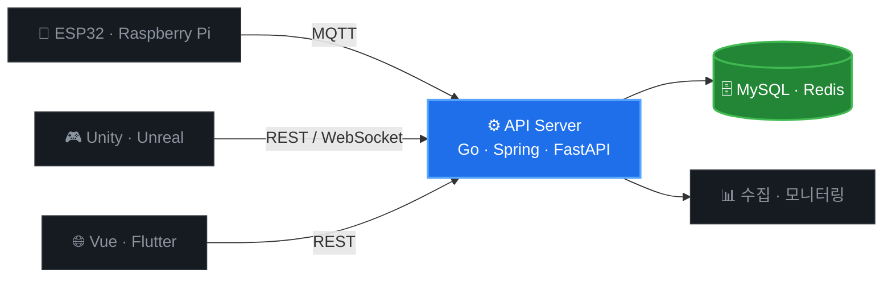
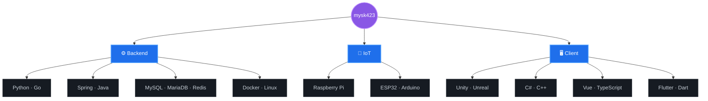

<h1 align="center">mysk423</h1>

<b>Backend / Server Developer</b> 요청을 받는 쪽을 먼저 생각합니다

---

## 🧩 무엇을 만드는가

서버를 가운데 두고, 필요한 쪽을 붙입니다.

---

## 🛠️ 기술 스택

---

## 🙋‍♂️ About

| | |
|:--|:--|
| **Role** | Backend / Server Developer |
| **Focus** | API 설계 · 데이터 모델링 · 배포 운영 |
| **Also** | 게임 클라이언트 · 모바일 · 웹 · IoT 하드웨어 |
| **Now** | `실시간 통신` `분산 처리` `AI 도구 활용` |
| **Mail** | mysk423@naver.com |

---

## 📦 프로젝트

| | 프로젝트 | 설명 | 스택 |
|:--:|:--|:--|:--|
| 🔌 | **project-a** | 한 줄 설명을 여기에 | `Go` `MySQL` `ESP32` |
| 🎮 | **project-b** | 한 줄 설명을 여기에 | `Unity` `C#` |
| 🌐 | **project-c** | 한 줄 설명을 여기에 | `Vue` `Spring` |

---

