  

**요청을 받는 쪽을 먼저 생각합니다**

서버를 짓고, 필요하면 클라이언트도 직접 붙입니다

 

### ⚡ ABOUT

<table align="center">
<tr>
<td width="140" align="center"><b>ROLE</b></td>
<td>Backend / Server Developer</td>
</tr>
<tr>
<td align="center"><b>FOCUS</b></td>
<td>API 설계 · 데이터 모델링 · 배포 운영</td>
</tr>
<tr>
<td align="center"><b>ALSO</b></td>
<td>Unity · Unreal · Flutter · Vue · Raspberry Pi · ESP32</td>
</tr>
<tr>
<td align="center"><b>NOW</b></td>
<td><code>실시간 통신</code> <code>분산 처리</code> <code>AI 도구 활용</code></td>
</tr>
<tr>
<td align="center"><b>MAIL</b></td>
<td><a href="mailto:mysk423@naver.com">mysk423@naver.com</a></td>
</tr>
</table>

### ⚡ STACK

 

### ⚡ PROJECTS

<table align="center">
<tr>
<td width="33%" align="center"><b>🔌 project-a</b> 한 줄 설명  <code>Go</code> <code>ESP32</code></td>
<td width="33%" align="center"><b>🎮 project-b</b> 한 줄 설명  <code>Unity</code> <code>C#</code></td>
<td width="33%" align="center"><b>🌐 project-c</b> 한 줄 설명  <code>Vue</code> <code>Spring</code></td>
</tr>
</table>

