<div align="center">



</div>

<br />

---

## 🌱 &nbsp;CONTRIBUTIONS

<sub>`~/contributions`</sub>

```
$ git log --graph --all
```

<div align="center">

<picture>
  <source media="(prefers-color-scheme: dark)"  srcset="https://raw.githubusercontent.com/mysk423/mysk423/output/snake-dark.svg" />
  <source media="(prefers-color-scheme: light)" srcset="https://raw.githubusercontent.com/mysk423/mysk423/output/snake-light.svg" />
  
</picture>

</div>

<br />

---

## ⚙️ &nbsp;ABOUT

<sub>`~/about`</sub>

```
NAME        mysk423
ROLE        Backend / Server Developer
FOCUS       API 설계 · 데이터 모델링 · 배포 운영
ALSO        게임 클라이언트 · 모바일 · 웹 · IoT 하드웨어
CONTACT     mysk423@naver.com
```

서버를 중심으로 봅니다. 요청을 어떻게 받고, 어디에 쌓고, 어떻게 내보낼지를 먼저 정한 다음
필요한 클라이언트를 붙입니다. ESP32가 물려도, Unity가 물려도 결국 뒤에는 같은 서버가 있습니다.

<br />

---

## 🛠️ &nbsp;STACK

<sub>`~/stack`</sub>

**Backend**


**Database**


**IoT / Embedded**


**Game**


**Client**


**Tools**


<br />

---

## 📮 &nbsp;CONTACT

<sub>`~/contact`</sub>

<a href="mailto:mysk423@naver.com"></a>
<a href="https://github.com/mysk423"></a>

